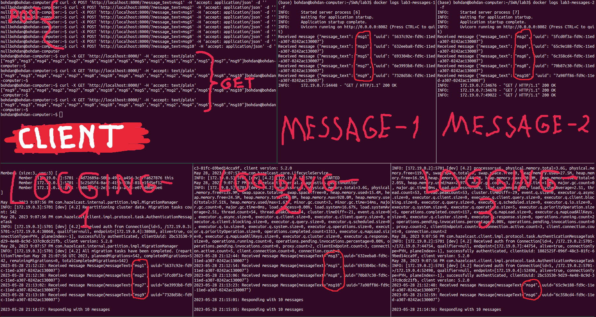

# SWAms
Software Architecture labs on microservices

### Prerequisites

- You need to have **Docker Engine** and **Docker Compose** installed on your machine

### Usage

To create and run compose project, run the following command in the project root directory and wait for servers to start (Gradle finishes the last):
```bash
$ PORT=8000 docker compose up
```
where `8000` is the TCP port of host's `localhost` on which the app (facade service) will be available.

To remove the created compose project, run:
```bash
$ docker compose down --rmi all
```

### Example



### Notes

This was tested only on AMD64 with Ubuntu 22.04.

