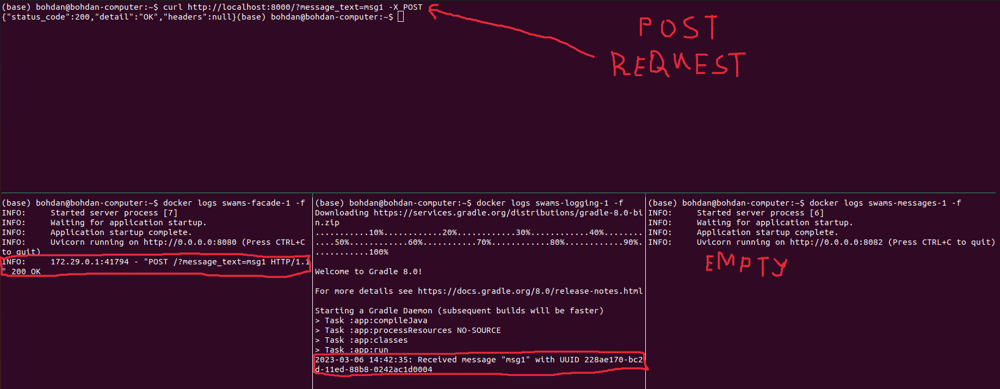
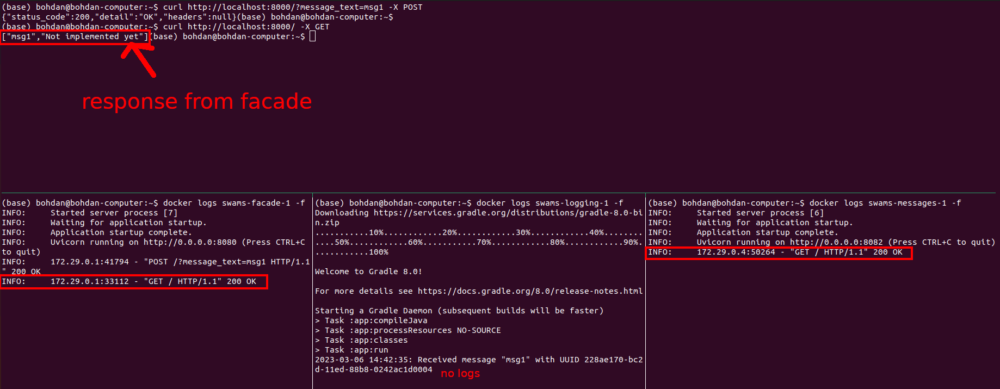
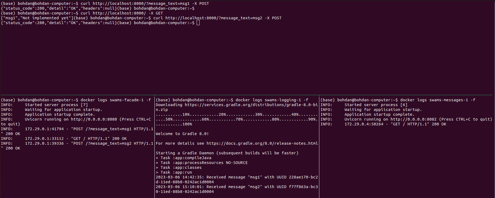
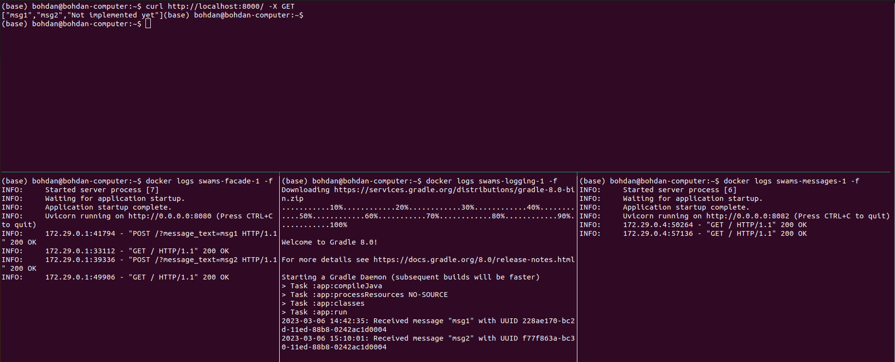

# SWAms
Software Architecture labs on microservices

## Laboratory work #1
Link to Github: <a href="https://github.com/bogdanmagometa/SWAms/tree/micro_basics">https://github.com/bogdanmagometa/SWAms/tree/micro_basics</a>

### Prerequisites

- You need to have **Docker Engine** and **Docker Compose** on your machine

### Usage

To create and run compose project, run the following command in the project root directory and wait for servers to start (Graddle finished the last):
```bash
$ PORT=8000 docker compose up
```
where `8000` is the TCP port of host's `localhost` on which the app (facade service) will be available.

To remove the created compose project, run:
```bash
$ docker compose down --rmi all
```

### Example

Output after first POST request:


Output after first GET request:


Output after second POST request:


Output after second GET request:


### Notes

This was testsed only on AMD64 with Ubuntu 22.04.

