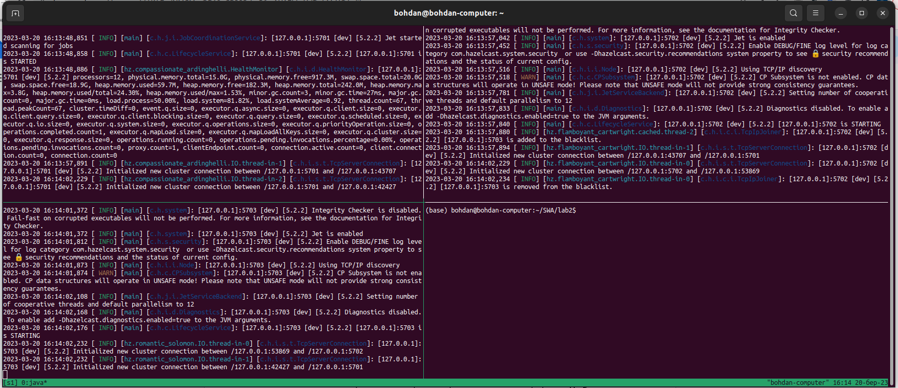
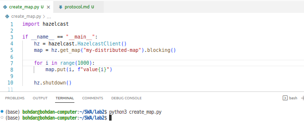
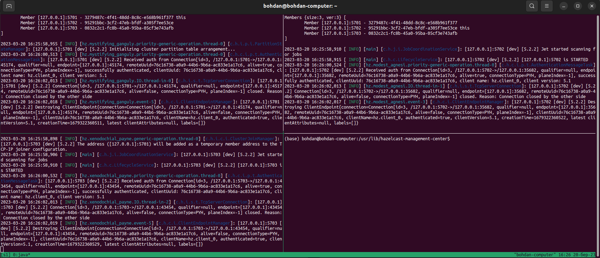
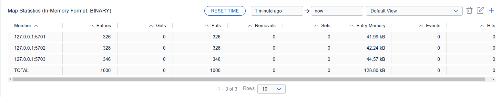
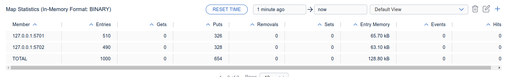
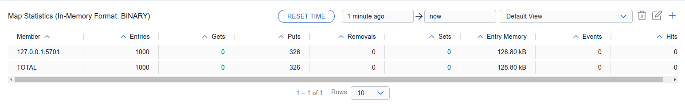
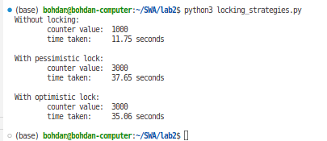
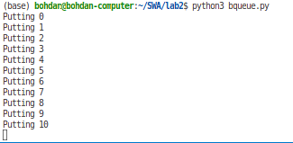
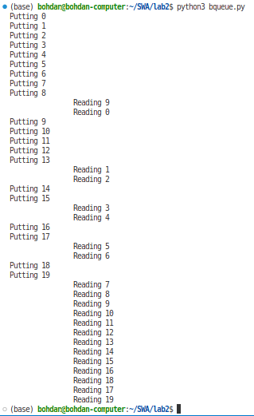
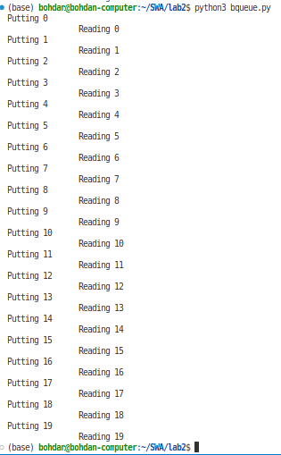

# Protocol: lab2

## 2. Configure 3 instances

## 3. Demonstrate usage of Distributed Map

- write 1000 values into a distributed map:

Output of command:

Hazelcast logs:

- look into distribution of values in Management Center:

as we can see, the entries are distributed almost equally:

- remove nodes

After removing one node, the entries were not lost:

After removing two nodes, the entries were not lost:

## 4. Demonstrate working with Distributed Map with locks

In the first case, we have race condition and loss of data, so we do not get 3000.

In case of pessimistic and optimistic locks, there are no race conditions. Optimistic lock seems to be a little bit faster, but we haven't probed it statistically.

## 5. Configure Bounded Queue

- When there are no reads (0 consumers), the put operation blocks:

- When there is at least one consumer, the bounded queue might block the provider until reads occur:

or the consumers might be fast enough to keep the queue not full:

